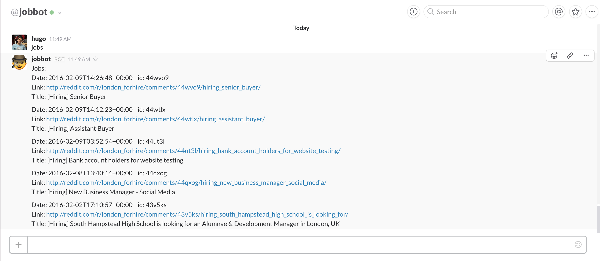
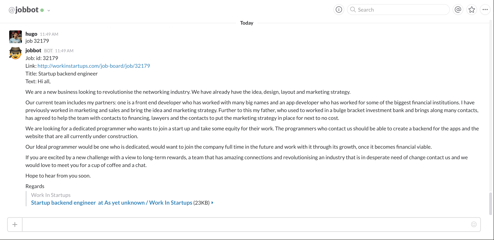

# Ruby Job SlackBot 

Integrates with Job APIs to deliver jobs to people right in Slack.

# The code
##JobBot 
JobBot is the SlackBot itself and handles the routing/matching/parsing of commands, it uses [slack-ruby-bot](https://github.com/dblock/slack-ruby-bot)
##JobController
JobController is the utility class, an instance of it is held by the JobBot class. It holds the jobs, sources and filters content before returning it.
##JobGrabber 
JobGrabber is loops through sources and returns an array of all jobs found at specified sources
##SrcGrabber
SrcGrabber grabs jobs from a specified source, it uses the adapter pattern and has 2 adapters: `reddit.rb`, `workinstartups.rb` and `hackernews.rb`.
##Adapters
We have three adapters for Reddit, WorkInStartups and HNJobs, that use [Redd](https://github.com/avinashbot/redd), [workinstartups-api](https://github.com/HugoDF/workinstartups-api) and [hnjobs](https:github.com/HugoDF), respectively.
##Job
Job is the abstraction to create a unified API for jobs coming from Reddit and WorkInStartups, there is potential for turning this into a adaptor system for jobs coming from other services, it currently only has 6 fields: `origin`, `id`, `title`, `description`, `created_at` and `link`.

#Setup your own
You're going to need to clone the repo, you can then proceed to fill out the ENV variables you need a slack custom integration token, a reddit client and secret. 

Locally it's best to keep them in an `.env` file (with dotenv these automatically get loaded in). An example `.env` file is provided so you can run `cp .env.example .env` from the command line to set up your local environment variables.

To deploy on heroku you will need to set the variables either through the panel or with the heroku command line tools.

#Talking to the bot

`hello` will give you the following message:

##Basics
- `jobs` gives you a set of jobs
- `job <id>` gives you a more in-depth description of the job
- `jobs count` does what is says on the tin
- `jobs refresh` will refetch all the jobs from the currently active sources

`help` will print the following:

##Filtering
- `jobs in:<category>` filters by keyword present in the description of jobs (eg. `jobs in mysql`)
- `jobs from:<date>` or `jobs <date>` gets jobs posted since 'date' (eg. `jobs from 01/01/2016` or `jobs today`) NOTE: you can't have whitespaces so use underscores or hyphens instead
- `jobs src:<source>` will filter to an individual source without removing/adding all the sources

##Modifying the sources
- `src` shows you where we're getting the jobs from
- `add src:<name>` with `name` in the form `reddit:<subreddit>` or `workinstartups:<category>`
- `remove src:<name>` removes any source that contains `name` eg. `remove source reddit` will delete `reddit:for_hire`, `reddit:freelance_forhire`...

##Extra settings
- `jobs limit:<number>` sets the maximum number of jobs displayed per command

## Copyright and License

Copyright (c) 2016, [Hugo Di Francesco](https://twitter.com/hugo__df) and [awebots](http://www.awebots.com).

This project is licensed under the [MIT License](LICENSE.md).